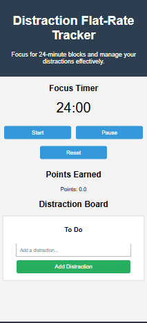
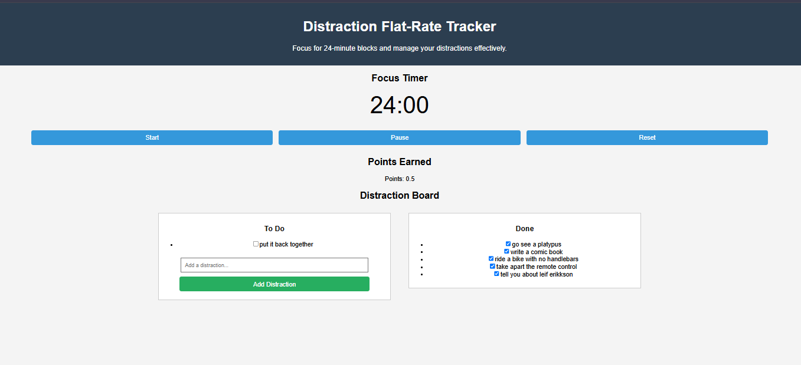

# distraction

What can you complete in 6 minutes?

a time management game. Gain points when time blocks are completed, organize distracting thoughts, and maximize efficiency. 

365 days in a year.
52 weeks in a year.
7 days in a week.
24 hours in a day.
60 minutes in an hour.
60 / 10 = 6 minute intervals.

Track your time.
Minimize distractions.
Maximize Efficiency.
Earn Points. Spend your time. 

# Idea Evolution
1. Initial Idea: 
2. Mobile First Adjustments: 
3. Added checklist functionality: 

# How to
Input your task name, start your first 24 minute timer. get rewards when you finish your time block. take a 6 minute break. begin the next timer. This system allows you to accomplish 48 minutes of dedicated, focused, efficient time every hour while also being rewarded at the end of each block. 

Want to check your social media notifications? you'll have 6 minutes at the end of your time block. add 'check notifications' to your distraction board then check that off your list when you've completed it. 

Each 24 minute interval that is successfully focused will grant you 0.4 points. Therefore your (2) 24 minute sessions each hour will grant you a score of 0.8 points. Your goal to reach efficiency status is to successfully reach at least 1.0 point per hour. Therefore, during your (2) 6 minute breaks, you must find an additional 0.2 points by completing distraction tasks. 

# FAQ
* "but when will I eat lunch?"
* "but what if my distraction task takes longer than 6 minutes?"
* "but what if I don't get 1.0 point per hour?"
* "but what if I forget to start my timer?"
* "how do I decide what is included in my current focus session, and what is a distraction?"

# Ideas for future functions:
* 