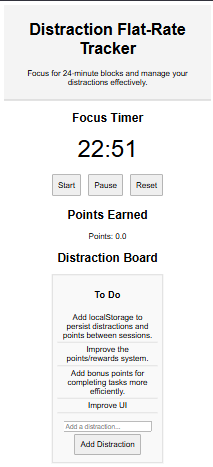

# distraction
a time management game. Gain points when time blocks are completed, organize distracting thoughts, and maximize efficiency. 

365 days in a year.
52 weeks in a year.
7 days in a week.
24 hours in a day.
60 minutes in an hour.
60 / 10 = 6 minute intervals.

Track your time.
Minimize distractions.
Maximize Efficiency.
Earn Points. Spend your time. 

Initial Idea: 